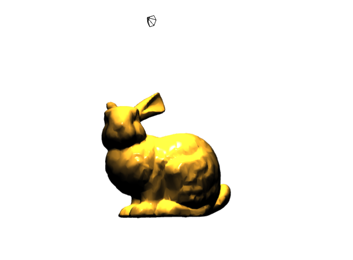

# Blinn-Phong Shading with WebGL



A WebGL implementation of the Blinn-Phong shading model applied to the Stanford Bunny, featuring dynamic point light and spotlight visualization with interactive controls.

## Features
- **Blinn-Phong Lighting**: Real-time per-pixel lighting with ambient, diffuse, and specular components.
- **Interactive Models**:
  - Rotate/translate the Stanford Bunny using mouse controls.
  - Dynamic point light (cube) with auto-rotation toggle (`P` key).
  - Adjustable spotlight (cone) with directional control (`S` key to toggle movement).
- **WebGL Optimizations**: Vertex Buffer Objects (VBOs), Index Buffer Objects (IBOs), and Vertex Array Objects (VAOs) for efficient rendering.

## Installation
- **Clone the Repository**:
   ```bash
   git clone https://github.com/abay-kulamkadyr/blinn-phong-shading_webGL.git
   cd blinn-phong-shading_webGL
   ``` 
   Run a Local Server (Required for loading shaders):

   ```bash
    python server.py
   ```
   Access via Browser: Open http://localhost:8000 in a WebGL-supported browser.

## Controls
Mouse:

    Left Drag: Translate the Bunny.

    Right Drag: Rotate the Bunny.

Keyboard:

    ↑/↓: Zoom in/out.

    R: Reset view.

    P: Toggle point light rotation.

    S: Toggle spotlight movement.


## Technical Highlights

Blinn-Phong Shading:

- Vertex Shader: Computes world-space positions/normals and light vectors.

- Fragment Shader: Implements lighting equation:
     

   ```glsl
    vec3 R = normalize(reflect(-lightDir, normal));
    vec3 H = normalize(lightDir + viewDir);
    float specular = pow(max(dot(normal, H), 0.0), shininess);


   ```

- Normal Calculation: Face normals averaged across adjacent triangles for smooth shading.

## Dependencies

    Modern WebGL2-compatible browser
    Python 3.x (for local server)
